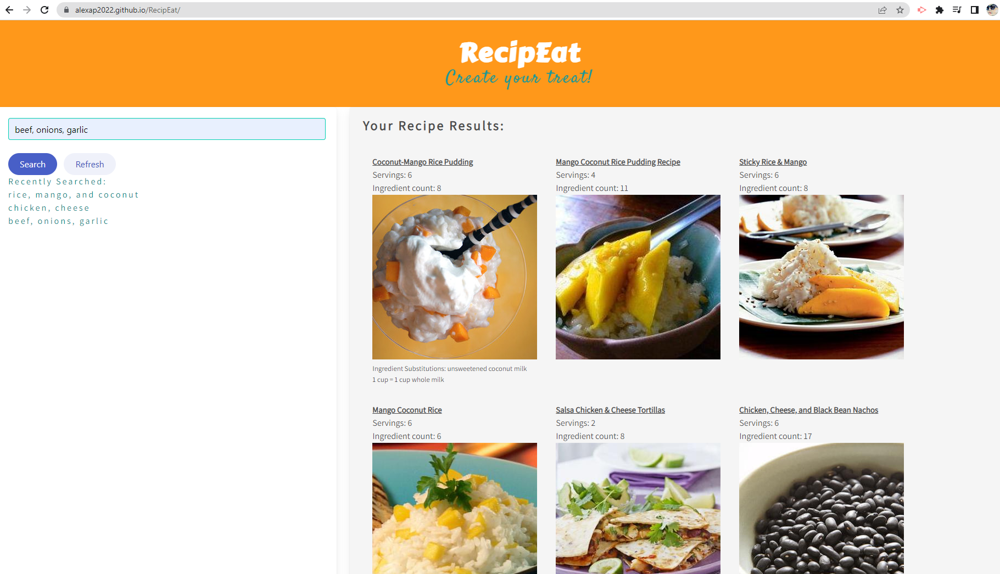

# RecipEat - A recipe search engine based on user entered ingredients

Application Concept Development:

We developed the app to help prevent food waste by encouraging users to use what they have on hand, while exploring fun and diverse recipes.  At the end of the week, we usually have a handful of ingredients in our fridge that may end up in the trash before we set out to restock at the grocery store.  With this app you can enter those ingredients into the search input and find a recipe that can help inform your next shopping trip, reducing food waste and perhaps saving the user money and time.

Project Description:

In this application the user will be able to enter ingredients into the search input and four recipes will appear per search to the right side of the window. The users ingredient search history is saved to local storage and displays on the page under "previously searched". The application also utilizes two different APIs, Edamam (the main API used to fetch recipes) and Spoonacular (used to fetch ingredient substitutions, as applicable).  Team members worked collaboratively by creating deadlines and kan-ban tasks in GitHub for each team member to meet.

Technologies Used:
- CSS framework: Bulma (https://bulma.io/) & custom CSS 
- Javascript, HTML
- API's: Edamam and Spoonacular

Links to Deployed Application and Repository:

[Deployed Application](https://alexap2022.github.io/RecipEat/)  
[Git Hub Repository](https://github.com/AlexaP2022/RecipEat/)

Screenshots of Deployed Application:

Application Landing Page:

First set of searched ingredients:

Second set of searched ingredients:

Ingredients-List saved to local storage as an array:

